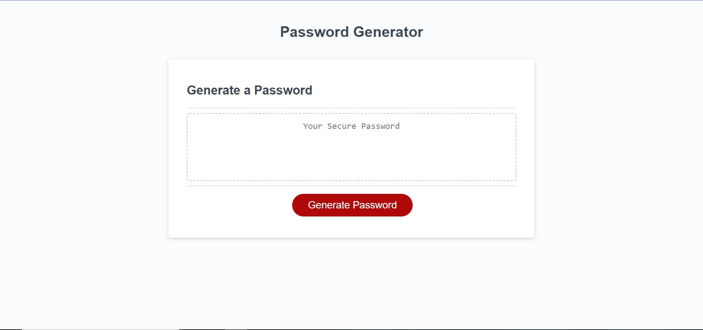
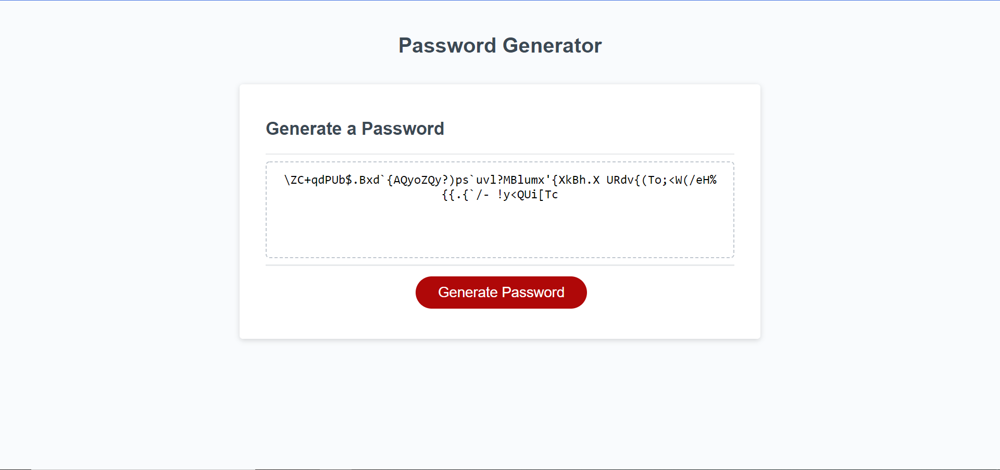

# Password Generator

---

Title: Password Generator   
Developer: Robyn Arnecke   
Deployment Date: 01/02/2022   
Published: Github https://ribbonanarchy.github.io/03-Unit3-HW-Password-Generator/   

---

## Summary:

The user is presented with an unpopulated textbox and a button that will begin the process of generating a password. 

Once the user clicks the button, they are first prompted with a question about the desired length of the password. Once the user enters a value between 8 and 128, they are then prompted about the types of characters they would like to include in their generated password. They have the option of including lowercase letters, uppercase letters, numbers, and special characters. They must choose at least one character type to proceed with the generation. 

Pictured above we have a 80-character password that includes lowercase letters, uppercase letters and special characters. Numbers were excluded from this generation. 

## Development: 

I worked on this program in sections. First, I made sure the length prompt was working before I did the input validation (checking if the number was between 8 and 128). 

Then I prompted the user for the types of characters they would like to include in their password, using if statements to concatenate the type of characters that the user chose to a master array. 

Then I included a for loop that would randomly select characters from my master array to populate each index of the password array. At this point I made sure that the length and types of characters were being applied to the output password correctly. 

After that, I put in my input validation to make sure that the user chose at least one style of character for their password. 